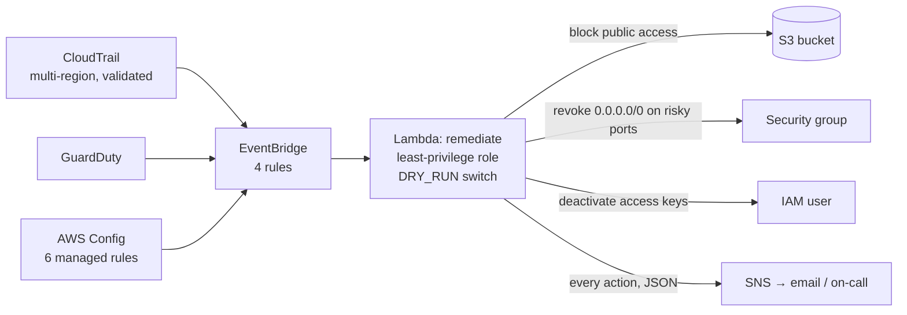

# AWS Security Auto-Remediation

_Portfolio sprint timeline: January–September 2026. Reported results retain their actual run dates._

Detective controls (CloudTrail, GuardDuty, AWS Config) wired through EventBridge to a Lambda that
fixes a small set of unambiguous, reversible findings within seconds — and alerts on everything
else. Deployed with Terraform; the Lambda is tested against a mocked AWS account so the behaviour is
verified before it ever touches a real one.



## What gets fixed automatically, and what does not

| Trigger | Action | Why it is safe to automate |
|---|---|---|
| Config `s3-bucket-public-read/write-prohibited` → NON_COMPLIANT | Put a full **Public Access Block** on the bucket | Nothing in this account should be public; the block is one click to remove if it ever should be |
| Config `restricted-ssh` / `restricted-common-ports`, or CloudTrail `AuthorizeSecurityGroupIngress` | **Revoke** ingress from `0.0.0.0/0` or `::/0` on 22, 3389, 3306, 5432, 1433, 27017, 6379, or all-traffic | Other rules on the group (e.g. 443 from anywhere, 22 from 10/8) are left alone — the test proves it |
| GuardDuty `UnauthorizedAccess:IAMUser/*`, severity ≥ 7 | Set the user's access keys **Inactive** | Deactivate, not delete: reversible, and it stops the bleeding while a human looks |
| GuardDuty anything else ≥ 4 | **Alert only** | Judgement required |
| Root console login | **Alert only, page on-call** | Never lock root out automatically |

Every action publishes a structured JSON record to SNS: what, on which resource, dry-run or not,
and the exact rules revoked. `DRY_RUN=true` (the Terraform default) logs and alerts what *would*
happen; flip it to `false` once you trust the behaviour in your account.

## Verified behaviour ([`tests/test_handler.py`](tests/test_handler.py), moto)

```
public bucket gets a Public Access Block; second run is "already_blocked"      ✓
COMPLIANT evaluations are ignored                                                ✓
0.0.0.0/0 on :22 revoked, 0.0.0.0/0 on :443 and 10/8 on :22 kept                ✓
all-traffic from anywhere revoked                                                ✓
GuardDuty credential-compromise finding deactivates the user's keys              ✓
low-severity GuardDuty finding is alert-only                                     ✓
root login is never auto-remediated                                              ✓
DRY_RUN changes nothing but still alerts                                         ✓
every action is published to SNS                                                 ✓
```

`terraform validate` and `terraform fmt -check` run in CI; the Lambda policy grants exactly the
seven API actions the handler calls, scoped to the account.

## Deploy

```bash
cd terraform
terraform init
terraform apply -var alert_email=you@example.com         # dry_run = true by default
# confirm the SNS subscription email, then watch CloudWatch Logs for /aws/lambda/security-auto-remediation
terraform apply -var alert_email=you@example.com -var dry_run=false
```

Try it: create a security group rule `0.0.0.0/0` on port 22 in the console and watch it disappear,
with an email explaining why.

Cost: CloudTrail (first trail free), GuardDuty (30-day trial then ~$1–5/month at this scale), Config
(~$2/month for six rules), Lambda/EventBridge/SNS (cents). `terraform destroy` removes everything;
both S3 buckets are `force_destroy`.

## Layout

```
lambda/remediate/handler.py   the function: event routing + three remediations + notify
tests/test_handler.py         moto-backed behavioural tests
terraform/detective.tf        CloudTrail, GuardDuty, Config recorder + rules
terraform/remediation.tf      SNS, Lambda (+ least-privilege IAM), EventBridge rules and targets
```

## Next

- Ship the SNS topic into a ticketing tool (Jira/ServiceNow) so every action opens a case.
- Add `iam-user-mfa-enabled` remediation: attach a deny-all-until-MFA policy rather than alert.
- Security Hub as the single event source instead of three.
- Terratest/`terraform plan` against a sandbox account in CI with OIDC.

## Acknowledgments

AI tools assisted with documentation and repository organization.
